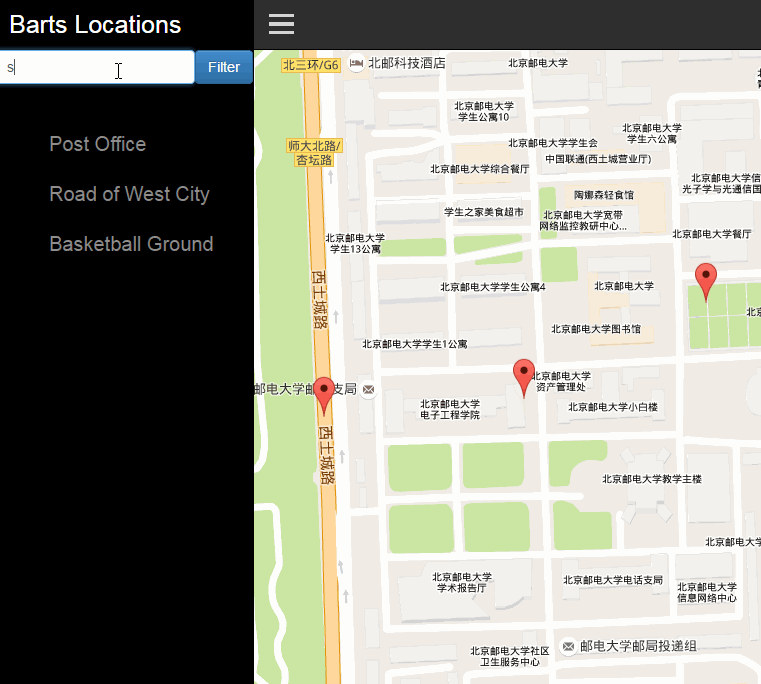

# fullstack udacity-neighborhood-map
> this practice project is form udacity

## preview

## How to start?

 1. you need has a browser. I think you have.
 2. clone this project into your machine,or download the zip file from github.
 3. run the `index.html` via browser.
 4. you will see the project.
